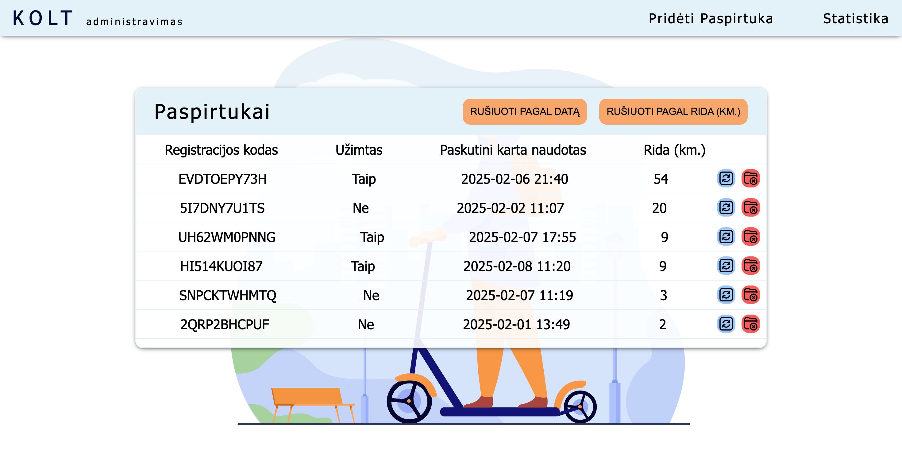

# 🛴 Scooter Management App

A modern and responsive web application for managing electric scooters. This app allows you to **add scooters**, **track and sort them**, and **view detailed statistics** – all with a clean, user-friendly design.

## 🚀 Features

- Add and manage scooters with detailed information  
- Sort and filter scooters by various criteria  
- View usage and performance statistics  
- Responsive design – works great on desktop and mobile  
- Stylish and intuitive UI  
- Data stored locally using **LocalStorage** (no backend required)

## 📸 Preview



## 🛠️ Tech Stack

- HTML / CSS / React
- Responsive design principles  
- LocalStorage for persistent data  

## 🛠️ Installation & Usage

1. **Clone the repository**  
   ```bash
   git clone https://github.com/Ignaulis/kolt_scooters_admin.git
   ```

2. **Install dependencies**  
   ```bash
   npm install
   ```

3. **Start the development server**  
   ```bash
   npm run dev
   ```

## 📝 License

This project is open source and available under the [MIT License](LICENSE).
